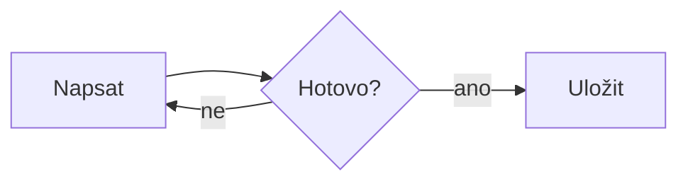
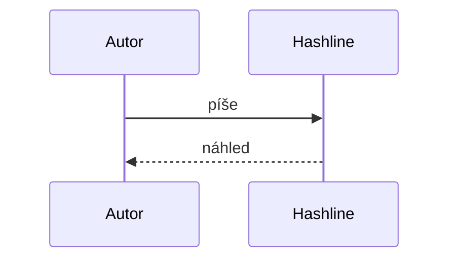

# Matematika a diagramy

Einsteinova rovnice $E = mc^2$ a zlomek $\frac{a}{b}$ v textu. Cena $5 a $10 zůstane textem.

$$
\int_0^\infty e^{-x^2}\,dx = \frac{\sqrt{\pi}}{2}
$$

```math
\sum_{k=1}^{n} k = \frac{n(n+1)}{2}
```






