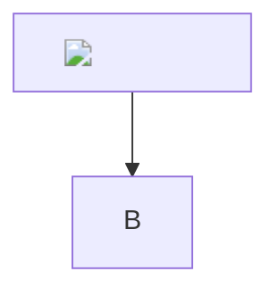

# XSS corpus (F10)
Every vector tries to set the document title to PWNED. Nothing may change it.

## Vector 1

<script>document.title='PWNED'</script>

## Vector 2

<SCRIPT SRC=http://x/xss.js></SCRIPT>

## Vector 3

<<script>script>document.title='PWNED'<</script>/script>

## Vector 4

<scr<script>ipt>document.title='PWNED'</scr</script>ipt>

## Vector 5


## Vector 6


## Vector 7


## Vector 8


## Vector 9


## Vector 10

<script>document.title='PWNED'</script>">

## Vector 11


## Vector 12


## Vector 13


## Vector 14

document.title='PWNED'</script>">

## Vector 15


## Vector 16


## Vector 17

<svg onload=document.title='PWNED'>

## Vector 18

<svg><script>document.title='PWNED'</script></svg>

## Vector 19

<math><mtext><table><mglyph><style>

## Vector 20

<details open ontoggle=document.title='PWNED'>x</details>

## Vector 21

<body onload=document.title='PWNED'>

## Vector 22

<iframe src=javascript:document.title='PWNED'></iframe>

## Vector 23

<iframe srcdoc="<script>document.title='PWNED'</script>"></iframe>

## Vector 24

<object data=javascript:document.title='PWNED'></object>

## Vector 25

<embed src=javascript:document.title='PWNED'>

## Vector 26

<link rel=stylesheet href=javascript:document.title='PWNED'>

## Vector 27

<meta http-equiv="refresh" content="0;url=javascript:document.title='PWNED'">

## Vector 28

<base href="javascript:document.title='PWNED'//">

## Vector 29

<form><button formaction=javascript:document.title='PWNED'>x</button></form>

## Vector 30

<input autofocus onfocus=document.title='PWNED'>

## Vector 31

<style>@import 'javascript:document.title='PWNED'';</style>

## Vector 32

<div style="background:url(javascript:document.title='PWNED')">x</div>

## Vector 33

<a href="javascript:document.title='PWNED'">x</a>

## Vector 34

<a href="JaVaScRiPt:document.title='PWNED'">x</a>

## Vector 35

<a href="  javascript:document.title='PWNED'">x</a>

## Vector 36

<a href="jav&#x09;ascript:document.title='PWNED'">x</a>

## Vector 37

<a href="jav	ascript:document.title='PWNED'">x</a>

## Vector 38

<a href="&#106;&#97;&#118;&#97;&#115;&#99;&#114;&#105;&#112;&#116;&#58;document.title='PWNED'">x</a>

## Vector 39

<a href=javascript&colon;document.title='PWNED'>x</a>

## Vector 40

<a href="vbscript:msgbox(1)">x</a>

## Vector 41

<a href="data:text/html;base64,PHNjcmlwdD5hbGVydCgxKTwvc2NyaXB0Pg==">x</a>

## Vector 42

<a href="x" onmouseover="document.title='PWNED'">x</a>

## Vector 43

<a title='x' onclick='document.title='PWNED'' href='#'>x</a>

## Vector 44

<kbd onclick=document.title='PWNED'>x</kbd>

## Vector 45

<!---->

## Vector 46

<!-- --!> -->

## Vector 47


## Vector 48

<xss onafterscriptexecute=document.title='PWNED'><script>1</script>

## Vector 49

<a href="#" xlink:href="javascript:document.title='PWNED'">x</a>

## Vector 50

[x](javascript:document.title='PWNED')

## Vector 51

[x](JaVaScRiPt:document.title='PWNED')

## Vector 52

[x](  javascript:document.title='PWNED'  )

## Vector 53

[x](javascript&#58;document.title='PWNED')

## Vector 54

[x](&#x6A;avascript:document.title='PWNED')

## Vector 55

[x](<javascript:document.title='PWNED'>)

## Vector 56

[x](vbscript:document.title='PWNED')

## Vector 57

[x](data:text/html;base64,PHNjcmlwdD5hbGVydCgxKTwvc2NyaXB0Pg==)

## Vector 58

<javascript:document.title='PWNED'>

## Vector 59

[x][r]

[r]: javascript:document.title='PWNED'

## Vector 60


## Vector 61


## Vector 62

[a](http://x "\" onmouseover=\"document.title='PWNED'")

## Vector 63


## Vector 64

# 

## Vector 65

| a |
|---|
|  |

## Vector 66

Text[^1]

[^1]: 

## Vector 67

`<script>document.title='PWNED'</script>`

## Vector 68

```html
<script>document.title='PWNED'</script>
```

## Vector 69



## Vector 70

$\href{javascript:document.title='PWNED'}{x}$

## Vector 71

$$
\url{javascript:document.title='PWNED'}
$$

## Vector 72

---
title: </code></pre><script>document.title='PWNED'</script>
---

x

## Vector 73

:rocket:<script>document.title='PWNED'</script>

## Vector 74

====

## Vector 75

www.example.com/"><script>document.title='PWNED'</script>

## Vector 76

- [ ] 

## Vector 77

> <iframe src=javascript:document.title='PWNED'>
