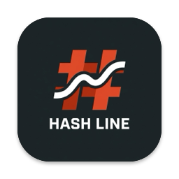
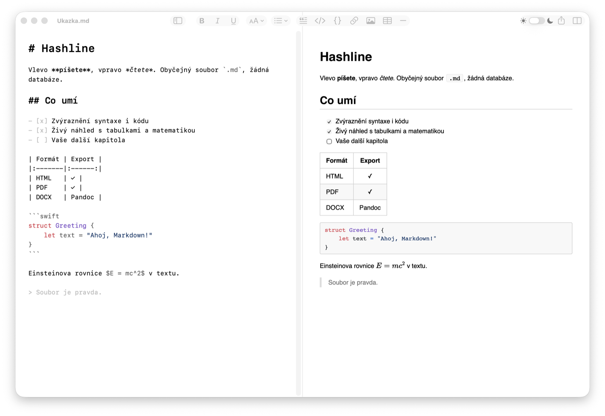

<p align="center">
  
</p>

<h1 align="center">Hashline</h1>

<p align="center">
  <strong>Nativní markdown editor pro macOS.</strong><br>
  Vlevo zdroj se zvýrazněnou syntaxí, vpravo živý HTML náhled. Obyčejné soubory <code>.md</code>, žádná databáze, žádný účet.
</p>

<p align="center">
  <a href="https://github.com/Hessevalentino/hashline/releases/latest"></a>
  <a href="https://github.com/Hessevalentino/hashline/releases"></a>
  <a href="LICENSE"></a>
  
  
  
</p>

<p align="center">
  
  
  
  
  
  
</p>

<p align="center">
  <a href="https://github.com/Hessevalentino/hashline/releases/latest/download/Hashline.dmg"><strong>Stáhnout DMG</strong></a>
  &nbsp;·&nbsp;
  <a href="https://hashline.hesse.works/">Web projektu</a>
  &nbsp;·&nbsp;
  <a href="CHANGELOG.md">Změny</a>
</p>

<picture>
  <source media="(prefers-color-scheme: dark)" srcset="docs/images/screenshot-dark.png">
  
</picture>

## Obsah

- [Proč Hashline](#proč-hashline)
- [Stažení a instalace](#stažení-a-instalace)
- [Funkce](#funkce)
- [Technologie](#technologie)
- [Výkon](#výkon)
- [Sestavení ze zdrojů](#sestavení-ze-zdrojů)
- [Licence](#licence)

## Proč Hashline

- **Píše se, nic se nenastavuje.** Otevře se okamžitě, ukáže text a pak nepřekáží.
- **Soubor je pravda.** Pracuje s obyčejnými `.md` na disku. Žádný vlastní formát ani databáze.
- **Nativní.** Swift, AppKit a TextKit 2, žádný Electron. Světlý i tmavý režim, zkratky, Undo, Služby, Quick Look.
- **Rychlý.** Psaní pod 10 ms i v 1MB dokumentu, otevření 1 MB pod 200 ms. Měří se, neodhaduje ([docs/perf.md](docs/perf.md)).
- **Bezpečný a soukromý.** Sandbox, náhled bez JavaScriptu stránky, sanitizace HTML, žádná telemetrie.

## Stažení a instalace

Požadavky: **macOS 14 Sonoma** nebo novější, Mac s **Apple Silicon**.

1. Stáhněte [`Hashline.dmg`](https://github.com/Hessevalentino/hashline/releases/latest/download/Hashline.dmg) z [posledního vydání](https://github.com/Hessevalentino/hashline/releases/latest).
2. Otevřete DMG a přetáhněte Hashline do složky **Aplikace**.
3. **Při prvním spuštění povolte výjimku.** Hashline je podepsaný ad-hoc (bez placeného účtu Apple Developer), takže ho macOS napoprvé zablokuje hláškou, že aplikaci nelze ověřit:
   - Klikněte na **Hotovo** (ne na „Přesunout do koše“).
   - Otevřete **Nastavení systému ▸ Soukromí a zabezpečení**, sjeďte dolů k hlášce o aplikaci Hashline a klikněte na **Přesto otevřít**. Potvrďte heslem nebo Touch ID.
   - Pak se Hashline spouští normálně.

   Alternativa v Terminálu:

   ```sh
   xattr -dr com.apple.quarantine /Applications/Hashline.app
   ```

**Aktualizace:** při druhém spuštění se Hashline zeptá, jestli má jednou týdně hledat nové verze ([Sparkle](https://sparkle-project.org)). Aktualizace jsou podepsané klíčem EdDSA, takže se nainstaluje jen verze z tohoto projektu. Ručně: **Hashline ▸ Check for Updates…**

## Funkce

| | |
|---|---|
| ✍️ **Editor** | TextKit 2, zvýraznění Markdownu i bloků kódu (36 nejběžnějších jazyků), formátovací lišta, chytré seznamy, úprava tabulek tabulátorem |
| 👁️ **Náhled** | GFM tabulky, úkoly, poznámky pod čarou, `[toc]`, emoji, matematika (KaTeX), diagramy (Mermaid), lokální i vzdálené obrázky, synchronní scrollování |
| 🗂️ **Knihovna** | Složka dokumentů, strom složek, osnova, hledání v knihovně ⇧⌘F, rychlé otevření ⌘P, najít a nahradit s regexem |
| 🎨 **Vzhled** | Přepínač ☀︎ / ☾ v liště, témata `theme.json` + `theme.css` (Paper, Tomorrow Night, Solarized), písmo, výška řádku, šířka textu |
| 🧘 **Režimy** | Čtení ⌘/, soustředění F8, psací stroj F9, stavový řádek se slovy, znaky a dobou čtení |
| 📤 **Export** | HTML, PDF se záložkami, PNG, přes [Pandoc](https://pandoc.org) DOCX, ODT, RTF, ePub, LaTeX, MediaWiki, RST, import přes Pandoc |
| 🍎 **macOS** | Quick Look pro `.md` ve Finderu, Služby („Nový dokument Hashline s výběrem“), Sdílení, čeština a angličtina, přístupnost |
| 🔒 **Bezpečnost** | App Sandbox, CSP, allow-list sanitizace HTML, test proti 77 XSS vektorům, ochrana proti nepřátelským dokumentům |

## Technologie

<p>
  
  
  
  
  
  
  
  
</p>

| Oblast | Použito |
|---|---|
| Jazyk a UI | Swift 6 (strict concurrency), SwiftUI pro okna a nastavení, AppKit (`NSTextView`, `NSToolbar`) |
| Editor | TextKit 2, inkrementální parsování po blocích, stylování jen viditelné oblasti |
| Markdown | [swift-markdown](https://github.com/swiftlang/swift-markdown) (cmark-gfm): CommonMark + GitHub Flavored Markdown |
| Náhled | WebKit (`WKWebView`) bez JavaScriptu stránky, DOM se mění po blocích z izolovaného světa skriptů |
| Zvýraznění kódu | [highlight.js](https://highlightjs.org) v JavaScriptCore mimo hlavní vlákno |
| Matematika a diagramy | [KaTeX](https://katex.org) (JavaScriptCore), [Mermaid](https://mermaid.js.org) |
| Export | WebKit tisk a PDFKit (záložky), volitelně Pandoc |
| Aktualizace | [Sparkle 2](https://sparkle-project.org) s podpisem EdDSA |
| Build a kvalita | XcodeGen, Swift Testing, XCUITest, SwiftLint, os_signpost + Instruments |

Kód: ~10 800 řádků Swiftu v aplikaci a jádru (`HashlineCore`, testovatelné bez UI), ~2 300 řádků testů.

## Výkon

| Metrika | Rozpočet | Naměřeno (M4) |
|---|---|---|
| Latence psaní v 1MB dokumentu | < 16 ms | p50 ~6 ms, p95 ~7 ms |
| Otevření 1MB souboru | < 200 ms | 187–202 ms |
| Přepnutí režimu nebo tématu (1 MB) | < 50 ms | 2–40 ms |
| Velikost aplikace | < 15 MB | 13 MB |

Podrobnosti a metodika v [docs/perf.md](docs/perf.md).

## Sestavení ze zdrojů

Vyžaduje Xcode 16+ a XcodeGen.

```sh
brew install xcodegen swiftlint
git clone https://github.com/Hessevalentino/hashline.git
cd hashline
xcodegen generate
open Hashline.xcodeproj
```

Testy a měření z příkazové řádky:

```sh
swift test --scratch-path ~/Library/Caches/Hashline-spm   # jádro (parser, renderer, export, bezpečnost)
scripts/verify-security.sh                                 # XSS v prohlížeči, nepřátelské dokumenty
scripts/bench-typing.sh 3                                  # latence psaní
```

Pravidla projektu jsou v [CLAUDE.md](CLAUDE.md), architektonická rozhodnutí v [docs/adr](docs/adr) a plán v [docs/roadmap.md](docs/roadmap.md). Vydání: `scripts/release.sh`. Zdroj webu je ve složce [WEB](WEB).

## Licence

Hashline je open source pod licencí [MIT](LICENSE). Převzaté části (MacDown, highlight.js, KaTeX, Mermaid, gemoji, Sparkle, swift-markdown, cmark-gfm) mají vlastní licence, viz [Sources/Hashline/Resources/Licenses](Sources/Hashline/Resources/Licenses).
