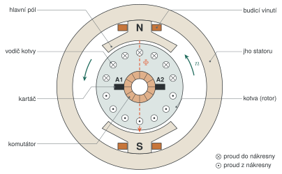

# Stejnosměrný stroj

## Konstrukce a princip

**Stator** tvoří ocelové jho s **hlavními póly**. Na pólech je **budicí vinutí**, které vytváří magnetický tok $\Phi$; u malých motorů ho nahrazují permanentní magnety. Větší stroje mají mezi hlavními póly ještě **pomocné (komutační) póly** a v pólových nástavcích **kompenzační vinutí**. Obojí omezuje jiskření a reakci kotvy.

**Kotva** (rotor) je svazek plechů na hřídeli a v jejích drážkách leží vinutí. Cívky vinutí jsou připojené na lamely **komutátoru** a na komutátor dosedají pevné uhlíkové **kartáče**.

*Příčný řez dvoupólovým strojem (schematicky; komutátor je ve skutečnosti na hřídeli vedle kotvy). Kartáče A1 a A2 leží v neutrální ose mezi póly. Pod pólem N teče proud vodiči kotvy jedním směrem, pod pólem S opačně, takže síly na vodiče vytvářejí moment stejného směru. Komutátor zajistí, že se směr proudu ve vodiči obrátí právě při přechodu z pólu N pod pól S.*

## Náhradní schéma a základní vztahy

*Obvod kotvy (vlevo) a obvod buzení (vpravo) stroje s cizím buzením. Šipky proudů odpovídají spotřebičové orientaci, tedy chodu motoru.*

Napětí na svorkách kotvy pokrývá indukované napětí a úbytek na odporu kotvy:

$$
U = U_i + R_a I_a
$$

Indukované napětí i moment jsou úměrné toku $\Phi$:

$$
U_i = c\,\Phi\,\omega, \qquad M = c\,\Phi\,I_a, \qquad \omega = \frac{2\pi n}{60}
$$

| Veličina | Význam | Jednotka |
|---|---|---|
| $U$ | napětí na svorkách kotvy A1–A2 | V |
| $U_i$ | indukované napětí kotvy | V |
| $R_a$ | odpor obvodu kotvy | Ω |
| $I_a$ | proud kotvy | A |
| $\Phi$ | magnetický tok jednoho pólu | Wb |
| $c$ | konstanta stroje | – |
| $n$ | otáčky | min⁻¹ |
| $\omega$ | úhlová rychlost | rad·s⁻¹ |
| $M$ | vnitřní moment | N·m |

---

Zdroje obrázků jsou editovatelné v `src/` (TikZ a CircuiTikZ, kompilace `tectonic soubor.tex`). PNG verze obou obrázků leží vedle SVG ve složce `img/`.
